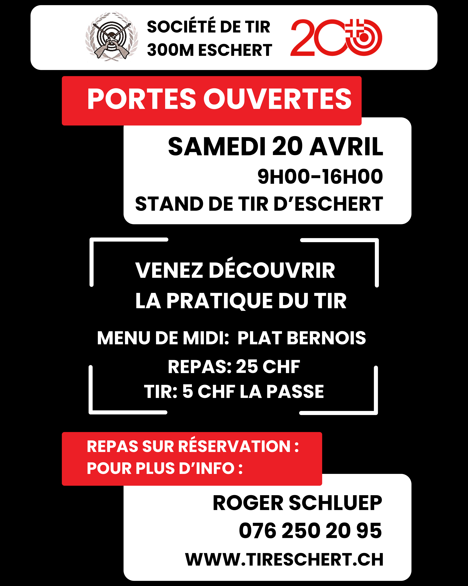

<p style="text-align: center;"></p>
<!-- omit from toc -->
# Bienvenue à la société de tir d'Eschert 300m

Salut,

Tu trouveras des liens utiles juste ici:

- [Portes ouvertes 2024](#portes-ouvertes-2024)
- [Militaires / Tir obligatoire](#militaires--tir-obligatoire)
- [Tir en campagne](#tir-en-campagne)
- [Le lieu (où c'est que c'est le stand quoi)](#le-lieu-où-cest-que-cest-le-stand-quoi)
- [Locations](#locations)
- [Contact](#contact)

Liens externes à cette page:
- [Tir Eschert: Activités 2024](https://drive.google.com/file/d/1TSqa0SJHZ6F1xZWQyyu6ipLkP1rrel1Y/view?usp=drive_link)
- [AJBST](https://ajbst.ch/)
- [vtg.admin: Tir hors du service](https://www.vtg.admin.ch/fr/tir-hors-du-service)
- [Notice sur le tir hors du service en 2024 PDF](https://www.vtg.admin.ch/content/vtg-internet/fr/mein-militaerdienst/ausserhalb-des-dienstes/sat/schiesswesen-ausser-dienst/_jcr_content/infotabs/items/schiesspflicht/tabPar/downloadlist/downloadItems/13_1609320804927.download/27_123_f_2024.pdf)
- [Tir obligatoire 2024 PDF](https://www.vtg.admin.ch/content/vtg-internet/fr/mein-militaerdienst/ausserhalb-des-dienstes/sat/schiesswesen-ausser-dienst/_jcr_content/infotabs/items/schiesspflicht/tabPar/downloadlist/downloadItems/261_1610952031454.download/27_124_f_2024.pdf)


## Portes ouvertes 2024
Cette année, nous avons le plaisir de t'accueillir dans notre stand pour vous partager notre passion du tir. Ça se déroule le samedi 20 avril, de 9h00 à 16h00. Toute personne est la bienvenue. Tu pourras t'y rendre en voiture, voir le lieu ici: [Le lieu](#le-lieu)

À savoir pour le tir:
- Pas besoin d'arme, ni de licence, ni de connaissances particulières
- Prend quand même une veste à longue manche et porte des pantalons longs
- Nos membres se feront une joie de t'accompagner pendant cette journée
  -  Avant le tir pour t'expliquer les bases et les règles de sécurité
  -  pendant le tir pour t'aider à faire des mouches (des coups en plein milieu de la cible)
  -  après le tir pour partager un verre avec toi
- Pour ceux qui possède une arme d’ordonnance (uniquement Fass 90, Fass 57 ou Mousqueton 31), tu peux la prendre avec. S'il-te-plaît veille à faire le contrôle d'entrer au stand par un de nos moniteur de tir **avant** d'entrer dans le stand


Repas de midi:
- A midi sera servi le plat bernois. **Merci de t'inscrire à l'avance** afin d'avoir suffisamment de portion pour tout le monde. Inscription ici: [Contact](#contact)
- Nous avons décidé de servir le menu au prix juste de 25 CHF. Le prix du menu comprend une participation de 5 CHF afin de soutenir les jeunes participant à la finale romande des jeunes tireurs qui qui a lieu cette année au stand de Malleray-Bévillard
<p style="text-align: center;"></p>

[Haut de la page ↑](#bienvenue-à-la-société-de-tir-deschert-300m)

## Militaires / Tir obligatoire
Si tu es astreint au service, c'est avec joie que nous t’accueillons à notre stand pour que tu accomplisses tes tirs obligatoires. Nos prochaines dates pour 2024:
- Mercredi 24 avril, 17h00 - 19h30
- Mercredi 28 avril, 17h00 - 19h30

Et puis si t'es pas astreint, ben viens quand même les tirer :). Cette année, nous accueillons aussi le tir en campagne

[Haut de la page ↑](#bienvenue-à-la-société-de-tir-deschert-300m)

## Tir en campagne
Grande fête de tir au niveau national, le tir cantonal est célébré le même week-end dans toute la suisse. Cette année, le tir en campagne a lieu le week-end du 24, 25 et 26 mai 2024. Beaucoup de stand sont ouvert à cette occasion. Mais c'est sans aucun doute à Eschert qu'il faut que tu viennes tirer cette année! Un repas sera servi le dimanche midi. Plus d'infos suivront ces prochains jours.

[Haut de la page ↑](#bienvenue-à-la-société-de-tir-deschert-300m)

## Le lieu (où c'est que c'est le stand quoi)
<p style="text-align: center;"><iframe src="https://www.google.com/maps/embed?pb=!1m18!1m12!1m3!1d10827.652940093783!2d7.377267375557257!3d47.2769505967108!2m3!1f0!2f0!3f0!3m2!1i1024!2i768!4f13.1!3m3!1m2!1s0x4791de60d8456f51%3A0xb32602153ef1e4f7!2sPr%C3%A9%20Beuclair%201%2C%202743%20Eschert!5e0!3m2!1sfr!2sch!4v1712697380799!5m2!1sfr!2sch" width="600" height="200" style="border:0;" allowfullscreen="" loading="lazy" referrerpolicy="no-referrer-when-downgrade"></iframe></p>

Et pour ceux qui aime les schémas, voici une vue de situation:
```
Delémont ↓
         ↓
      Moutier → ┬ ← Crémines ← ← Balsthal
         ↑   Eschert                ↑
  Bienne ↑                      Oensingen
```

[Haut de la page ↑](#bienvenue-à-la-société-de-tir-deschert-300m)

## Locations
Le stand est disponible à la location lorsque celui-ci n'est pas utilisé par les tireurs (nous) ou les chasseurs. Le stand possède une pièce principale pouvant accueillir jusqu'à 30 personnes. Une terrasse couverte avec cheminée est aussi à disposition et peux accueillir 40 personnes. Nous avons une cuisine équipée de plaques de cuissons, d'un four et d'un lave-vaisselle industrielle. Nous avons aussi 2 WC séparée pour dames et messieurs.

Les informations sur la disponibilité ainsi que les prix te seront volontiers communiquées en détail par Corinne Flückiger d'Eschert via téléphone au 079 445 92 47.


[Haut de la page ↑](#bienvenue-à-la-société-de-tir-deschert-300m)

## Contact
Pour toute questions sur la société, les tirs au stand, l'agenda, etc. c'est ici:
```
Président tir 300m Eschert
Roger Schluep
Vergers Dedos 26
2747 Corcelles-BE
076 250 20 95
roger.schluep@gmail.com
```

Pour les location:
```
Corinne Flückiger
079 445 92 47
```

[Haut de la page ↑](#bienvenue-à-la-société-de-tir-deschert-300m)
