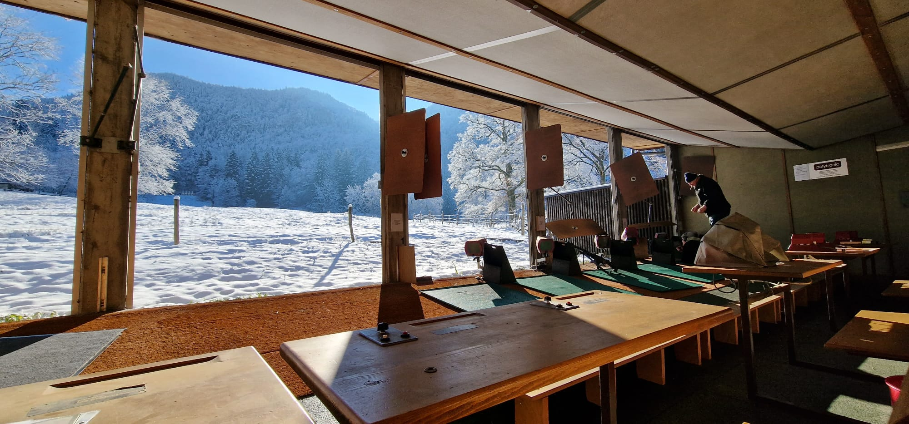

<p style="text-align: center;"></p>
<!-- omit from toc -->
<h1 id="main_title">Bienvenue à la société de tir d'Eschert 300m</h1>

Salut,

Tu trouveras des liens utiles juste ici:

- [Agenda](#agenda)
- [Tir au porc 2024](#tir-au-porc-2024)
- [Tir en campagne - 24 au 26 mai 2024](#tir-en-campagne---24-au-26-mai-2024)
- [Sortie du tir cantonale](#sortie-du-tir-cantonale)
- [Portes ouvertes 2024](#portes-ouvertes-2024)
- [Militaires / Tir obligatoire](#militaires--tir-obligatoire)
- [Le lieu (où c'est que c'est le stand quoi)](#le-lieu-où-cest-que-cest-le-stand-quoi)
- [Locations](#locations)
- [Contact](#contact)

Liens externes à cette page:
- [Tir Eschert: Activités 2024](https://drive.google.com/file/d/1TSqa0SJHZ6F1xZWQyyu6ipLkP1rrel1Y/view?usp=drive_link)
- [AJBST](https://ajbst.ch/)
- [vtg.admin: Tir hors du service](https://www.vtg.admin.ch/fr/tir-hors-du-service)
- [Notice sur le tir hors du service en 2024 PDF](https://www.vtg.admin.ch/content/vtg-internet/fr/mein-militaerdienst/ausserhalb-des-dienstes/sat/schiesswesen-ausser-dienst/_jcr_content/infotabs/items/schiesspflicht/tabPar/downloadlist/downloadItems/13_1609320804927.download/27_123_f_2024.pdf)
- [Tir obligatoire 2024 PDF](https://www.vtg.admin.ch/content/vtg-internet/fr/mein-militaerdienst/ausserhalb-des-dienstes/sat/schiesswesen-ausser-dienst/_jcr_content/infotabs/items/schiesspflicht/tabPar/downloadlist/downloadItems/261_1610952031454.download/27_124_f_2024.pdf)

## Agenda
<p id="agenda"></p>

<script>
var myDoc = document.getElementById("agenda");
var myMainWidth = document.getElementById("main_title");

var w = myMainWidth.offsetWidth;

const iframe_agenda = document.createElement('iframe');
iframe_agenda.src = "https://calendar.google.com/calendar/embed?height=600&wkst=2&ctz=Europe%2FZurich&bgcolor=%23F6BF26&showTabs=0&showCalendars=0&title=Occupation%20du%20Stand%20de%20tir%20Eschert&src=ZXNjaGVydC50aXJAZ21haWwuY29t&color=%23039BE5";
iframe_agenda.style = "border-width:0";
iframe_agenda.width= w;
iframe_agenda.height=(3*w)/4;
iframe_agenda.frameborder="0";
iframe_agenda.scrolling="no";

myDoc.appendChild(iframe_agenda);
</script>

## Tir au porc 2024

La Société de Tir d'Eschert a le plaisir de vous inviter à participer au **Tir au Porc 2024** ! Cet événement est ouvert à tous, que vous soyez débutant ou tireur expérimenté.

**Informations Clés**

- **Dates :**
  - Samedi 7 septembre 2024, 16h00 - 19h00
  - Samedi 28 septembre 2024, 16h00 - 19h00
  - Dimanche 29 septembre 2024,  9h00 - 12h00 / 14h00 - 17h00

- **Type de tir :**
  - Cible : A100
  - Nombre de coups : Illimité
  - Seuls les **6 meilleurs coups** seront pris en compte pour le classement final

- **Repas du dimanche midi :**
  - Un repas est prévu dimanche à midi.
  - Merci de vous inscrire jusqu'au 23 septembre 2024

**Venez nombreux !**

Que vous veniez pour le challenge ou simplement pour passer un bon moment, nous vous attendons avec impatience. Ne manquez pas cette occasion de tester vos compétences et de vous mesurer à d'autres passionnés de tir.

Pour toute information supplémentaire ou pour s'inscrire au diner, n'hésitez pas à [contacter](#contact) la Société de Tir d'Eschert.

À bientôt sur le stand !

[Haut de la page ↑](#bienvenue-à-la-société-de-tir-deschert-300m)

## Tir en campagne - 24 au 26 mai 2024
Nous tenons à remercier chaque personne qui a fait le déplacement au stand. Ce fut un week-end complètement fou où plus de 92 tireurs ont participé au tir en campagne. Notre société a battu son record d'affluence des 20 dernières années, et ceci grâce à vous. Je tiens aussi à remercier chacun qui a oeuvré à la réussite du week-end. Merci aux sociétés de Roches et Crémines-Corcelles pour leur travail ainsi qu'à chaque membre d'Eschert pour leur boulot 👍🏻

[Haut de la page ↑](#bienvenue-à-la-société-de-tir-deschert-300m)

## Sortie du tir cantonale
Cette année, la société a décidée de participer au tir cantonal jurassien. Un programme d'activité est organisé par Céline, merci de regarder avec elle pour les différentes informations. Pour rappel, la société tirera au stand de Soyhières le samedi 6 juillet dans l'après-midi comme suit:

```
Cible  97: 17h00 - 19h00
Cible  98: 13h30 - 18h00
Cible 100: 16h30 - 18h45
```
 
La centrale se situe à la halle des fêtes de Boécourt. Chaque tireur doit faire contrôler son arme avant de pouvoir participer au tir. Le passage à la centrale est en principe compris dans les activités de la journée.

[Haut de la page ↑](#bienvenue-à-la-société-de-tir-deschert-300m)

## Portes ouvertes 2024
Nous remercions chaque personne ayant participer à notre journée portes ouvertes. Ce fut un super moment qui a permis à de nombreuses personnes de découvrir la pratique du tir. Plus de 30 personnes ont pu s'essayer à faire des 10 à 300m et ce avec différentes armes.

La société considère de renouveler l'expérience l'an prochain. Plus d'informations en début d'année 2025.

[Haut de la page ↑](#bienvenue-à-la-société-de-tir-deschert-300m)

## Militaires / Tir obligatoire
Si tu es astreint au service, c'est avec joie que nous t’accueillons à notre stand pour que tu accomplisses tes tirs obligatoires. Nos prochaines dates pour 2024:

- Mercredi 24 avril, 17h00 - 19h30
- Mercredi 28 août, 17h00 - 19h30

Et puis si t'es pas astreint, ben viens quand même les tirer 😃. Cette année, nous accueillons aussi le tir en campagne.

[Haut de la page ↑](#bienvenue-à-la-société-de-tir-deschert-300m)

## Le lieu (où c'est que c'est le stand quoi)
<p id="map"></p>

<script>
var myDoc = document.getElementById("map");
var myMainWidth = document.getElementById("main_title");

var w = myMainWidth.offsetWidth;

const iframe_map = document.createElement('iframe');
iframe_map.src = "https://www.google.com/maps/embed?pb=!1m18!1m12!1m3!1d10827.652940093783!2d7.377267375557257!3d47.2769505967108!2m3!1f0!2f0!3f0!3m2!1i1024!2i768!4f13.1!3m3!1m2!1s0x4791de60d8456f51%3A0xb32602153ef1e4f7!2sPr%C3%A9%20Beuclair%201%2C%202743%20Eschert!5e0!3m2!1sfr!2sch!4v1712697380799!5m2!1sfr!2sch";
iframe_map.width= w;
iframe_map.height=(w)/2;
iframe_map.style="border:0;";
iframe_map.allowfullscreen="";
iframe_map.loading="lazy";
iframe_map.referrerpolicy="no-referrer-when-downgrade";

myDoc.appendChild(iframe_map);
</script>

Et pour ceux qui aime les schémas, voici une vue de situation:
```
Delémont ↓
         ↓
      Moutier → ┬ ← Crémines ← ← Balsthal
         ↑   Eschert                ↑
  Bienne ↑                      Oensingen
```

[Haut de la page ↑](#bienvenue-à-la-société-de-tir-deschert-300m)

## Locations
Le stand est disponible à la location lorsque celui-ci n'est pas utilisé par les tireurs (nous) ou les chasseurs. Le stand possède une pièce principale pouvant accueillir jusqu'à 30 personnes. Une terrasse couverte avec cheminée est aussi à disposition et peut accueillir 40 personnes. Nous avons une cuisine équipée de plaques de cuissons, d'un four et d'un lave-vaisselle industriel. Nous avons aussi 2 WC séparés pour dames et messieurs.

Les informations sur la disponibilité ainsi que les prix te seront volontiers communiqués en détail par Corinne Flückiger d'Eschert via téléphone au 079 445 92 47.

[Haut de la page ↑](#bienvenue-à-la-société-de-tir-deschert-300m)

## Contact
Pour toutes questions sur la société, les tirs au stand, l'agenda, etc. c'est ici:
```
Président tir 300m Eschert
Roger Schluep
Verger Dedos 26
2747 Corcelles-BE
076 250 20 95
roger.schluep@gmail.com
```

Pour les locations:
```
Corinne Flückiger
079 445 92 47
```

[Haut de la page ↑](#bienvenue-à-la-société-de-tir-deschert-300m)
