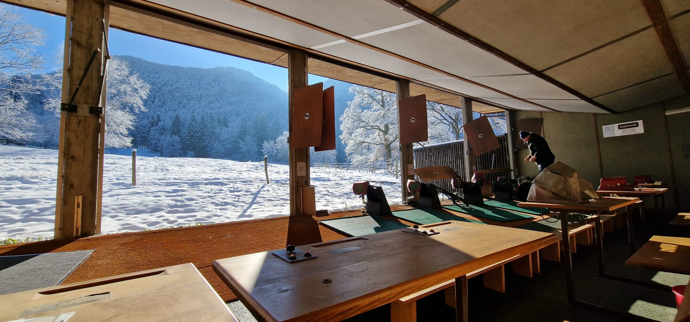

<p style="text-align: center;"></p>
<!-- omit from toc -->
<h1 id="main_title">Bienvenue à la société de tir d'Eschert 300m</h1>

Salut,

Tu trouveras des liens utiles juste ici:

- [Agenda](#agenda)
- [Tir de chasse](#tir-de-chasse)
- [Sortie au Tir Fédéral – 3 au 5 juillet 2026](#sortie-au-tir-fédéral--3-au-5-juillet-2026)
- [Tir au porc 2025 - classement](#tir-au-porc-2025---classement)
- [Militaires / Tir obligatoire](#militaires--tir-obligatoire)
- [Tir en campagne - 29 au 31 mai 2026](#tir-en-campagne---29-au-31-mai-2026)
- [Le lieu (où c'est que c'est le stand quoi)](#le-lieu-où-cest-que-cest-le-stand-quoi)
- [Locations](#locations)
- [Contact](#contact)

Liens externes à cette page:
- [Tir Eschert: Activités 2026](https://drive.google.com/file/d/1GpM8nn5yMs1DfIaqHa1BnwcV39hDYC-l/view?usp=sharing)
- [AJBST](https://ajbst.ch/)
- [vtg.admin: Tir hors du service](https://www.vtg.admin.ch/fr/tir-hors-du-service)

## Agenda
<p id="agenda"></p>

<script>
var myDoc = document.getElementById("agenda");
var myMainWidth = document.getElementById("main_title");

var w = myMainWidth.offsetWidth;

const iframe_agenda = document.createElement('iframe');
iframe_agenda.src = "https://calendar.google.com/calendar/embed?height=600&wkst=2&ctz=Europe%2FZurich&bgcolor=%23F6BF26&showTabs=0&showCalendars=0&title=Occupation%20du%20Stand%20de%20tir%20Eschert&src=ZXNjaGVydC50aXJAZ21haWwuY29t&color=%23039BE5";
iframe_agenda.style = "border-width:0";
iframe_agenda.width= w;
iframe_agenda.height=(3*w)/4;
iframe_agenda.frameborder="0";
iframe_agenda.scrolling="no";

myDoc.appendChild(iframe_agenda);
</script>

## Tir de chasse

Tu es sur le site internet du tir à 300m. Si c'est la chasse ou le Ball-trap qui t'intéresse, merci de contacter directement:

```
Schluep Fritz
Grand rue 33a
2608 Courtelary
Tél. M : +41 76 547 72 18
EMail: fritz.schluep@hotmail.fr
```

Autres contacts avec les sociétés de chasse du jura-bernois disponiblent ici:
https://bernerjagd.net/fr/sections-et-societes-de-chasse-jura-seeland/

[Haut de la page ↑](#bienvenue-à-la-société-de-tir-deschert-300m)

## Sortie au Tir Fédéral – 3 au 5 juillet 2026

Nous avons le plaisir de vous annoncer que la sortie au tir fédéral se déroulera **du 3 au 5 juillet 2026**, dans le magnifique canton des **Grisons**, en Suisse.

Planing complet dispo [ici](https://drive.google.com/file/d/1FfPTJ7smgRATAhYEDsfo_86ebzy0XdUB/view?usp=sharing)

Nous serons **une vingtaine de participants** et nous logerons au **Lindelhof à Churwalden**.  
Pour plus d’informations, vous pouvez consulter leur site : [Lindenhof – Churwalden](https://www.lindenhofchurwalden.ch/)

Préparez-vous à trois jours de sport, de détente et de convivialité dans un cadre alpin splendide.  
Nous comptons sur vous pour partager cette belle expérience ensemble !

[Haut de la page ↑](#bienvenue-à-la-société-de-tir-deschert-300m)

## Tir au porc 2025 - classement

| **Rg** | **Nom** | **Total** |  | **C1** | **C2** | **C3** | **C4** | **C5** | **C6** |
|:---:|---|:---:|---|:---:|:---:|:---:|:---:|:---:|:---:| 
| 1 | Bon Steven | 587 |  | 100 | 98 | 98 | 98 | 97 | 96 |
| 2 | Béguelin David | 586 |  | 99 | 99 | 97 | 97 | 97 | 97 |
| 3 | Correia Salgado Ricardo | 586 |  | 99 | 98 | 98 | 97 | 97 | 97 |
| 4 | Aschwanden Didier | 584 |  | 100 | 100 | 97 | 97 | 96 | 94 |
| 5 | Leuenberg Thierry | 582 |  | 99 | 98 | 97 | 96 | 96 | 96 |
| 6 | Schluep Roger | 582 |  | 99 | 98 | 98 | 96 | 96 | 95 |
| 7 | Schwab Henri | 580 |  | 99 | 98 | 97 | 97 | 96 | 93 |
| 8 | Beck Samanta | 575 |  | 98 | 98 | 97 | 97 | 94 | 91 |
| 9 | Flückiger Didier | 574 |  | 99 | 97 | 96 | 95 | 94 | 93 |
| 10 | Grossenbacher Nicolas | 570 |  | 98 | 96 | 95 | 94 | 94 | 93 |
| 11 | Comment Fernand | 569 |  | 100 | 97 | 96 | 93 | 92 | 91 |
| 12 | Muster Christophe | 569 |  | 99 | 95 | 95 | 94 | 93 | 93 |
| 13 | Leuenberger Gilbert | 568 |  | 99 | 95 | 94 | 94 | 93 | 93 |
| 14 | Stucki Pierre-Alexandre | 567 |  | 96 | 95 | 95 | 94 | 94 | 93 |
| 15 | Jäggi Jonas | 566 |  | 100 | 99 | 96 | 91 | 90 | 90 |
| 16 | Maia Luis | 566 |  | 98 | 97 | 96 | 92 | 92 | 91 |
| 17 | Minder Daniel | 564 |  | 100 | 93 | 93 | 93 | 93 | 92 |
| 18 | Röthlisberger Céline | 563 |  | 97 | 96 | 95 | 95 | 90 | 90 |
| 19 | Bon Yannick | 561 |  | 98 | 98 | 94 | 91 | 90 | 90 |
| 20 | Minder Laurent | 559 |  | 99 | 97 | 97 | 90 | 88 | 88 |
| 21 | Leuenberg Sandra | 553 |  | 98 | 94 | 92 | 91 | 91 | 87 |
| 22 | Pascal Paulus | 549 |  | 99 | 93 | 92 | 89 | 88 | 88 |
| 23 | Forster Robin | 547 |  | 100 | 99 | 89 | 88 | 86 | 85 |
| 24 | Cerf Yvan | 547 |  | 96 | 92 | 90 | 90 | 90 | 89 |
| 25 | Szabo Marika | 545 |  | 97 | 96 | 94 | 88 | 86 | 84 |
| 26 | Zanin Albino | 543 |  | 96 | 94 | 92 | 92 | 86 | 83 |
| 27 | Leuenberger Michel | 540 |  | 99 | 96 | 90 | 86 | 85 | 84 |
| 28 | Schaub Jason | 538 |  | 95 | 92 | 90 | 87 | 87 | 87 |
| 29 | Membrez Victor | 534 |  | 98 | 95 | 88 | 87 | 84 | 82 |
| 30 | Pugnant-Gros Gaël | 529 |  | 98 | 92 | 88 | 88 | 82 | 81 |
| 31 | Minder Rémy | 528 |  | 95 | 90 | 89 | 89 | 83 | 82 |
| 32 | Forster Maïk | 527 |  | 92 | 89 | 88 | 88 | 86 | 84 |
| 33 | Chèvre Cécile | 523 |  | 89 | 88 | 88 | 87 | 86 | 85 |
| 34 | Ganguin Mathieu | 516 |  | 92 | 88 | 88 | 84 | 82 | 82 |
| 35 | Aschwanden Raphael | 499 |  | 87 | 85 | 83 | 83 | 81 | 80 |
| 36 | Minder Hervé | 495 |  | 94 | 92 | 84 | 78 | 74 | 73 |
| 37 | Henriques Patricio | 457 |  | 92 | 91 | 77 | 73 | 65 | 59 |
| 38 | Minder Marc | 424 |  | 94 | 83 | 73 | 63 | 56 | 55 |
| 39 | Moreira Gilberto | 328 |  | 76 | 61 | 59 | 51 | 44 | 37 |
| 40 | Brêchet Kim | 183 |  | 51 | 45 | 41 | 33 | 13 | 0 |

[Haut de la page ↑](#bienvenue-à-la-société-de-tir-deschert-300m)

## Militaires / Tir obligatoire
Si tu es astreint au service, c'est avec joie que nous t’accueillons à notre stand pour que tu accomplisses tes tirs obligatoires. Nos prochaines dates pour 2026:

- Mercredi 29 avril, 17h00 - 19h30
- Mercredi 26 août, 17h00 - 19h30

Et puis si t'es pas astreint, ben viens quand même les tirer 😃.

[Haut de la page ↑](#bienvenue-à-la-société-de-tir-deschert-300m)

## Tir en campagne - 29 au 31 mai 2026

Cette année le tir aura lieu au stand de tir de **Roches**.

Horaires de tir:
```
Vendredi: 18h00 - 20h00
Samedi:   17h00 - 19h00
Dimanche:  9h00 - 11h30
```

Restauration sur place possible. Inscription au repas du dimanche midi chez Pierre-Alain Meyer.

[Haut de la page ↑](#bienvenue-à-la-société-de-tir-deschert-300m)

## Le lieu (où c'est que c'est le stand quoi)
<p id="map"></p>

<script>
var myDoc = document.getElementById("map");
var myMainWidth = document.getElementById("main_title");

var w = myMainWidth.offsetWidth;

const iframe_map = document.createElement('iframe');
iframe_map.src = "https://www.google.com/maps/embed?pb=!1m18!1m12!1m3!1d10827.652940093783!2d7.377267375557257!3d47.2769505967108!2m3!1f0!2f0!3f0!3m2!1i1024!2i768!4f13.1!3m3!1m2!1s0x4791de60d8456f51%3A0xb32602153ef1e4f7!2sPr%C3%A9%20Beuclair%201%2C%202743%20Eschert!5e0!3m2!1sfr!2sch!4v1712697380799!5m2!1sfr!2sch";
iframe_map.width= w;
iframe_map.height=(w)/2;
iframe_map.style="border:0;";
iframe_map.allowfullscreen="";
iframe_map.loading="lazy";
iframe_map.referrerpolicy="no-referrer-when-downgrade";

myDoc.appendChild(iframe_map);
</script>

Et pour ceux qui aiment les schémas, voici une vue de situation:
```
Delémont ↓
         ↓
      Moutier → ┬ ← Crémines ← ← Balsthal
         ↑   Eschert                ↑
  Bienne ↑                      Oensingen
```

[Haut de la page ↑](#bienvenue-à-la-société-de-tir-deschert-300m)

## Locations
Le stand est disponible à la location lorsque celui-ci n'est pas utilisé par les tireurs (nous) ou les chasseurs. Le stand possède une pièce principale pouvant accueillir jusqu'à 30 personnes. Une terrasse couverte avec cheminée est aussi à disposition et peut accueillir 40 personnes. Nous avons une cuisine équipée de plaques de cuissons, d'un four et d'un lave-vaisselle industriel. Nous avons aussi 2 WC séparés pour dames et messieurs.

Les informations sur la disponibilité ainsi que les prix te seront volontiers communiqués en détail par Corinne Flückiger d'Eschert via téléphone au 079 445 92 47.

[Haut de la page ↑](#bienvenue-à-la-société-de-tir-deschert-300m)

## Contact
Pour toutes questions sur la société, les tirs au stand, l'agenda, etc. c'est ici:
```
Président tir 300m Eschert
Roger Schluep
Verger Dedos 26
2747 Corcelles-BE
076 250 20 95
info@tireschert.ch
```

Pour les locations:
```
Corinne Flückiger
079 445 92 47
```

[Haut de la page ↑](#bienvenue-à-la-société-de-tir-deschert-300m)
